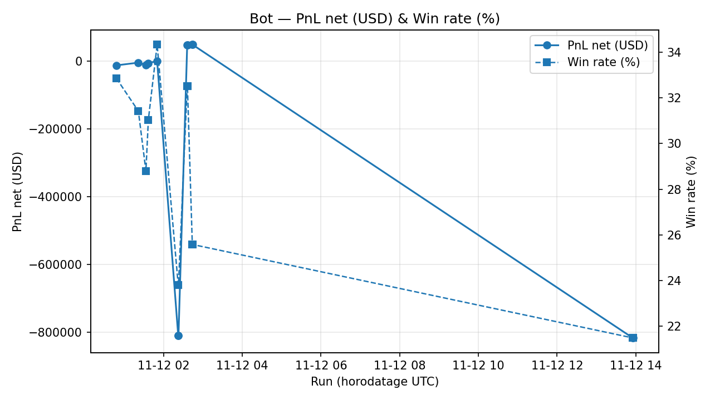

🤖 **Dernier run du bot multi-indicateurs**

- **Horodatage (UTC)** : `20251112T024404Z`
- **PnL net (USD)** : `$49290.0`
- **Trades** : 434
- **Win rate** : 25.58%

| Indicateur | Valeur |
|:-----------|-------:|
| EMA 9 | 9 |
| EMA 21 | 21 |
| SMA 50 | 50 |
| SMA 200 | 200 |
| RSI len | 14 |
| MACD (fast, slow, signal) | [12, 26, 9] |
| VWAP window | 195 |
| Volume MA window | 20 |
| Volume Profile window | 170 |

_Source des données :_ `data/mnq_5m.csv`
